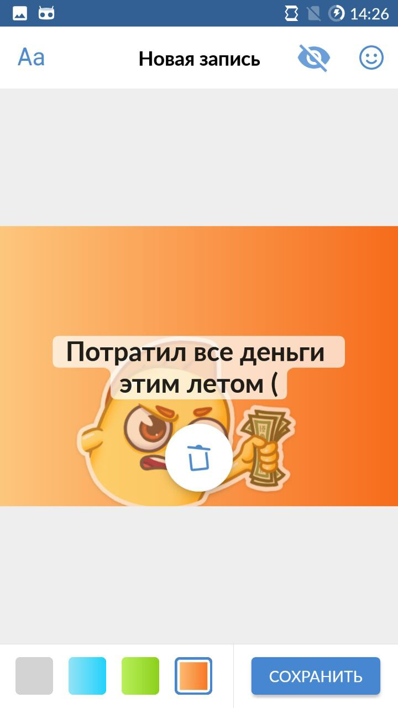

# vk-image

<h3>Приложение для создания постов-картинок из фотографий пользователя или встроенных в приложение подложек.</h3>
В приложение есть возможность добавления стикеров с последющим их перемещением, вращением и масштабированием. Для подбора подложек в приложение содержится базовый набор градиентных фонов и несколько изображений, а также имеется возможность выбора изображения с устройства пользователя.

